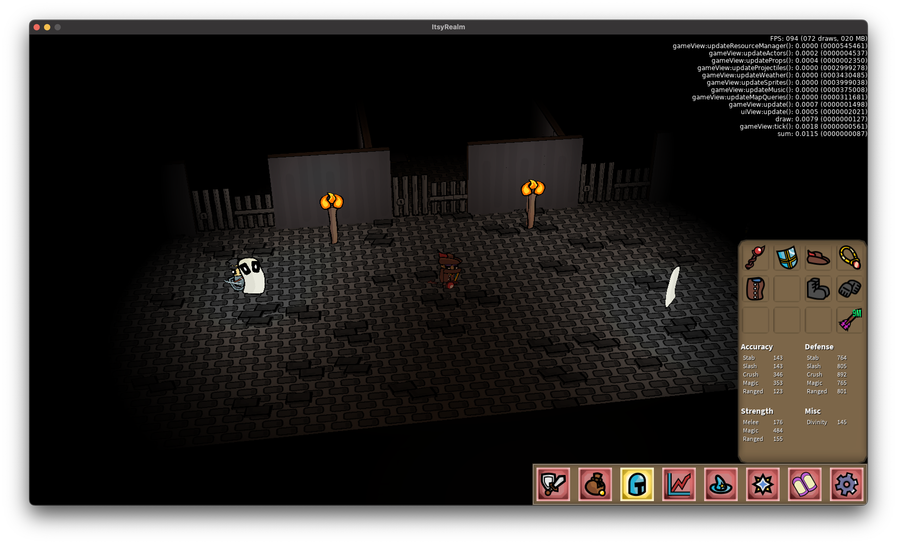

# Rumbridge Music

* Rumbridge is a port city, the southernmost Port on the mainland before adventuring into the dangerous South Seas and beyond
* Has a thriving farming community along the Rum River
* There's the Rumbridge monastery built over the widest point of the Rum River, serving as the primary bridge to the rest of the mainland from Rumbridge. They also make rum.

## Rumbridge Castle

* Earl Frederick governs Rumbridge
* Quests TBD include Super Supper Saboteur, where-in an assassin is attempting to ruin the Earl's fancy dinner part
* On the top floor, there's the Daemon Sleepyrosy
* Sits above dungeons, basement, and a lava cave

## Rumbridge town / port

* Town is a big shopping destination, featuring lots of shops
* The port is where the player would buy and manage their ship, as well as set sail from Rumbridge to wherever

## Rumbridge Castle, downstairs

* Basement is full of chocoroaches (chocolate cockroaches)
* Dungeon has ghosts (Boops) and guards
* Dungeon leads to fiery cavern full of iron

## Rumbridge caves

* First floor of a fiery cavern full of aggressive monsters
* Observed by the Skeletal shrimp
* Mine, smith, and smelt iron down here

